# Message Delivery Gateway
   ```mermaid
  sequenceDiagram
    participant Controller
    participant Service
    participant InternalMQ as Internal MQ (Staging)
    participant StagingConsumer as MQ Listener (Staging Consumer)
    participant OutboundMQ as Outbound MQ
    participant DB

    Controller->>Service: Call API
    activate Service
    Note right of Service: BEGIN JPA Transaction
    Service->>DB: Save record (PENDING)
    Service->>InternalMQ: Send correlationId to internal queue
    Note right of Service: COMMIT JPA Transaction
    deactivate Service

    InternalMQ->>StagingConsumer: Trigger listener
    activate StagingConsumer
    Note right of StagingConsumer: BEGIN JMS Transaction
    StagingConsumer->>DB: Optional DB lookup by correlationId
    StagingConsumer->>OutboundMQ: Send message to outbound MQ
    StagingConsumer->>DB: Update status (SENT / FAILED)
    Note right of StagingConsumer: COMMIT JMS Transaction
    deactivate StagingConsumer

```

```mermaid
flowchart TD
    A[Controller Layer] --> B[Service Layer<br/>@Transactional<br/>1. Save DB record<br/>2. Send to Internal MQ]
    B --> C[Internal MQ Queue &#40;Staging&#41;]
    C --> D[MQ Listener &#40;Staging Consumer&#41;<br/>@JmsListener &#40;JMS Tx&#41;<br/>1. Read from internal MQ<br/>2. Lookup DB if needed<br/>3. Send to outbound MQ<br/>4. Update DB status &#40;SENT / FAILED&#41;]
```

